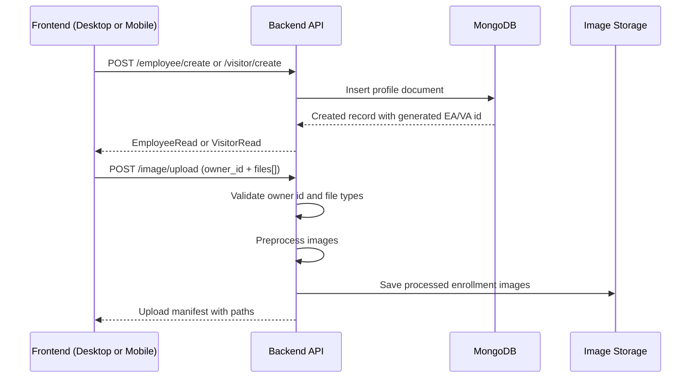
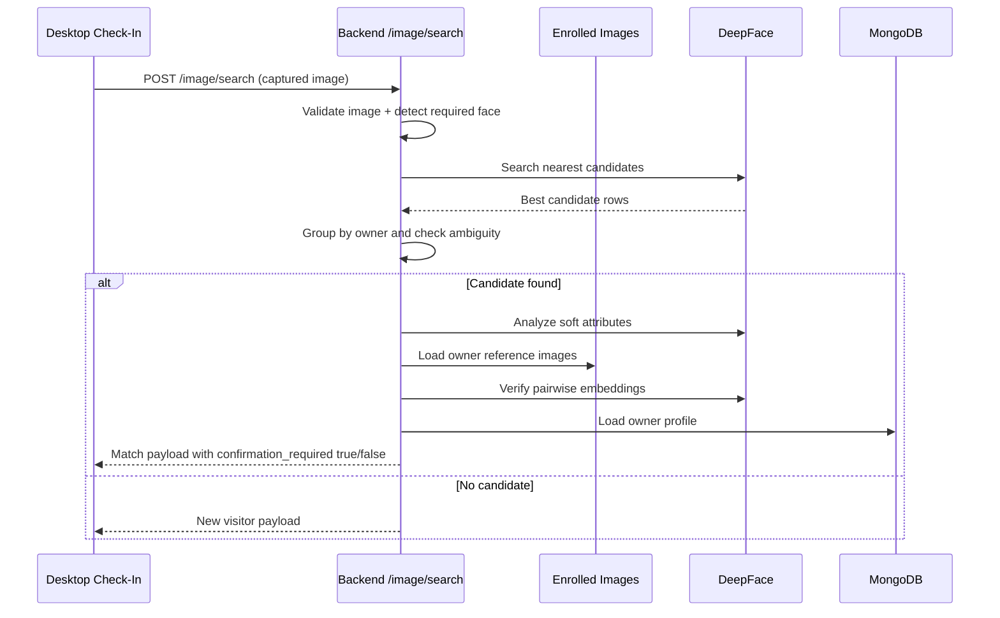
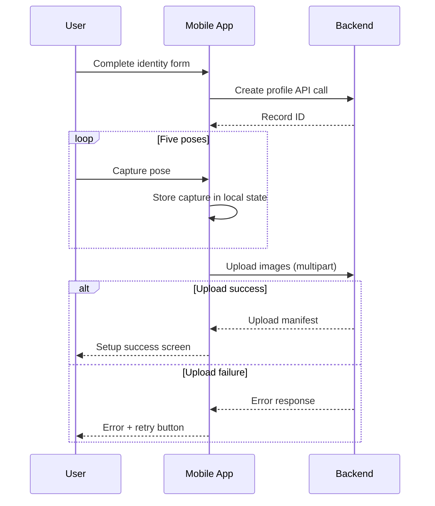

# Integration Flows and Payload Examples

## Scope

This document provides sequence-style descriptions of cross-component behavior with concrete API payload examples.

System components:

1. Desktop app
2. Mobile app
3. Backend API
4. MongoDB and image storage

## Flow 1: Employee or Visitor Enrollment



### Example request: create employee

```http
POST /employee/create
Content-Type: application/json
X-API-Key: <key>
```

```json
{
	"fullName": "Jane Doe",
	"gender": "female",
	"DoB": "1997-05-10",
	"email": "jane@example.com",
	"Phone": "+447000000000"
}
```

### Example response: created employee

```json
{
	"id": "EAABC123",
	"fullName": "Jane Doe",
	"gender": "female",
	"DoB": "1997-05-10",
	"email": "jane@example.com",
	"Phone": "+447000000000"
}
```

### Example request: upload enrollment images

```http
POST /image/upload
Content-Type: multipart/form-data
X-API-Key: <key>
```

Form fields:

1. owner_id: EAABC123
2. files: face_0.jpg ... face_4.jpg

### Example response: upload complete

```json
{
	"owner_id": "EAABC123",
	"owner_type": "employee",
	"uploaded": [
		"temp_images/EAABC123_20260411_102030_123456_face_0.jpg",
		"temp_images/EAABC123_20260411_102031_123457_face_1.jpg",
		"temp_images/EAABC123_20260411_102032_123458_face_2.jpg"
	]
}
```

## Flow 2: Recognition and Confirmation at Check-In



## Recognition Decision Branches

| Branch      | Condition                                  | Frontend-visible result                                         |
| ----------- | ------------------------------------------ | --------------------------------------------------------------- |
| No match    | No owner candidate found                   | message = Welcome new visitor, no owner object                  |
| Ambiguous   | Best owner too close to runner-up          | owner omitted, confirmation_required false                      |
| Unconfirmed | Owner candidate exists, verification fails | owner omitted, confirmation_required false                      |
| Confirmed   | Owner candidate and verification passes    | employee or visitor object returned, confirmation_required true |

## Flow 3: Mobile Face Setup and Upload Retry



## Contract Cross-Checks for Reports

When writing report claims, cross-reference these implementation points:

1. Backend orchestration: Backend/SOFRS-EA-Backend/backend/routers/Image.py
2. Search logic: Backend/SOFRS-EA-Backend/backend/utils/identity/searchId.py
3. Verification logic: Backend/SOFRS-EA-Backend/backend/utils/identity/verifyId.py
4. Desktop recognition mapping: Desktop/employee-access/src/services/verification.ts
5. Mobile capture/upload flow: Mobile/employee-access/app/face-scan.tsx

## Assumptions and Limitations

1. Matching quality depends on enrollment image quality and pose coverage
2. Current frontend behavior may infer recognition from response message text when explicit flags are absent
3. Image search can temporarily block repeated invalid requests per client for abuse protection
4. Soft attributes can be withheld for side-profile or low-confidence faces
