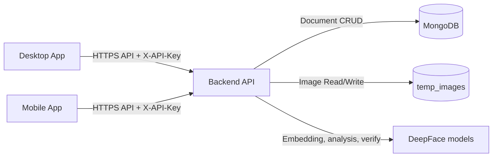

# SOFRS-EA System Overview

## Purpose

SOFRS-EA is a multi-client face-recognition system used to register employees and visitors, collect enrollment images, and perform recognition and identity confirmation during check-in.

The system has three major software components:

1. Desktop kiosk application (Electron + Vite + TypeScript)
2. Mobile application (Expo + React Native + TypeScript)
3. Backend API and recognition service (FastAPI + Beanie + MongoDB + DeepFace)

## High-Level Architecture

## Component Responsibilities

## Desktop Application

Primary responsibilities:

1. Kiosk-first user interface for registration and check-in
2. Five-pose face capture flow (front, left, right, up, down)
3. Real-time face-quality checks before capture
4. Identity verification screen and confidence display
5. Fallback relay server support for mobile camera streaming in specific kiosk scenarios

Main implementation area:

- Desktop/employee-access/src

## Mobile Application

Primary responsibilities:

1. User onboarding and identity details collection
2. Five-pose camera capture workflow
3. Upload of captured pose images to backend
4. Context-managed state for user details, captures, and created record IDs
5. Deep-link aware navigation flow

Main implementation area:

- Mobile/employee-access/app
- Mobile/employee-access/lib
- Mobile/employee-access/contexts

## Backend API

Primary responsibilities:

1. Authenticated API endpoints for employee/visitor CRUD operations
2. Image upload and image-search endpoints
3. Face preprocessing and quality gating
4. DeepFace-powered recognition search and verification logic
5. Structured response generation for frontend use

Main implementation area:

- Backend/SOFRS-EA-Backend/backend

## Core Data Domains

1. Employee
      - Persistent profile record with ID prefix EA
2. Visitor
      - Persistent profile record with ID prefix VA
3. Enrolled images
      - Preprocessed JPEG images stored in temp_images with owner-prefixed filenames
4. Recognition result
      - Response object containing match decision, optional profile data, analysis payload, and verification metadata

## End-to-End Functional Scope

## Enrollment scope

1. Create employee or visitor profile through POST API
2. Capture multiple face poses
3. Upload pose images linked to created owner ID
4. Store processed images in backend file storage

## Recognition scope

1. Capture image and submit to image-search endpoint
2. Detect and validate face in input image
3. Search nearest candidates in enrolled image set
4. Run verification against matched owner references
5. Return one of several decision branches:
      - No match
      - Ambiguous match
      - Match found but not confirmed
      - Match confirmed

## Security and Access Model

1. Protected endpoints require X-API-Key header
2. Employee, visitor, and image routes are API-key guarded
3. CORS policy allows configured origins and localhost development
4. Per-client temporary blocking is applied for repeated invalid image-search attempts

## Operational Behavior

1. Backend startup can run optional DeepFace warmup routines
2. Logging writes to console and rotating log file
3. Error handling wraps most async operations in shared helper functions

## Report Traceability Notes

Use the following references for implementation-backed claims:

1. Backend API runtime and routing: Backend/SOFRS-EA-Backend/backend/main.py
2. Image recognition orchestration: Backend/SOFRS-EA-Backend/backend/routers/Image.py
3. Desktop flow control: Desktop/employee-access/src/renderer.ts
4. Mobile navigation and state provider setup: Mobile/employee-access/app/\_layout.tsx
